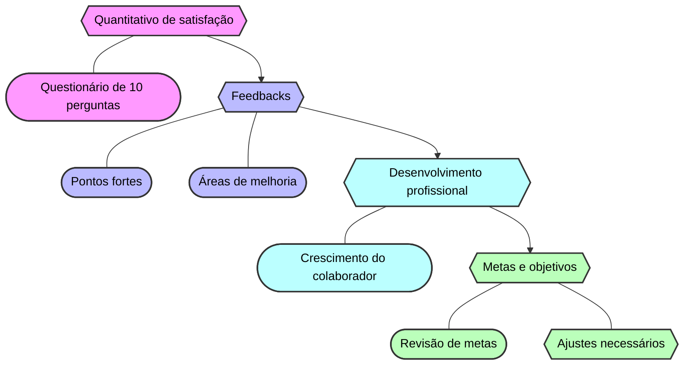

<h1 style="text-align: center">1:1</h1>

## 🤝 O que é ?

O 1:1 é uma reunião individual entre um colaborador e seu líder imediato. O objetivo é criar um espaço seguro para que ambos possam conversar sobre o desenvolvimento profissional do colaborador, suas metas, desafios e oportunidades de crescimento. É uma oportunidade para que o líder possa fornecer feedback, orientação e apoio ao colaborador, além de ajudá-lo a alcançar seu potencial máximo.

  
Mais informações

 
- O 1:1 é uma prática comum em empresas que valorizam o desenvolvimento profissional de seus colaboradores e buscam criar um ambiente de trabalho saudável e produtivo.

---

### 📆	ocorrem quinzenalmente.

  
Importante

- **O horário é pré-definido entre o colaborador e seu líder, estabelecendo uma regularidade de encontros a cada 15 dias, no horário combinado.**
- duração da reunião pode variar de acordo com a necessidade do colaborador e do líder.

---

### 📋 Como se preparar para o 1:1?

- Antes da reunião, é importante que o colaborador se prepare, refletindo sobre suas metas, desafios e conquistas, além de listar as questões que deseja discutir com seu líder.
- O líder também deve se preparar para o 1:1, revisando o desempenho do colaborador, identificando áreas de melhoria e pensando em maneiras de apoiá-lo em seu desenvolvimento profissional.
- Durante a reunião, ambos devem manter uma postura aberta e receptiva, ouvindo atentamente um ao outro e buscando soluções para os desafios identificados.

---

### ✨	Tópicos abordados

  
1 - Quantitativo de satisfação:

- O lider faz um questionario de em media 10 perguntas para saber como o colaborador se sente em relação ao trabalho, se está satisfeito com as atividades que realiza e se tem alguma sugestão para melhorar o ambiente de trabalho.

  
2 - Feedbacks:

- Durante o 1:1, o líder fornece feedback ao colaborador sobre seu desempenho, destacando pontos fortes e áreas de melhoria.

  
3 - Desenvolvimento profissional:

- O líder e o colaborador discutem oportunidades de desenvolvimento profissional, como treinamentos, cursos e projetos que possam contribuir para o crescimento e aprimoramento do colaborador.

  
4 - Metas e objetivos:

- O colaborador e o líder revisam as metas e objetivos estabelecidos anteriormente, discutindo o progresso e identificando possíveis ajustes para garantir que o colaborador esteja alinhado com as expectativas da empresa.

---

  
📊 Resultados Esperados

- **Criação de um espaço seguro para que o colaborador possa compartilhar suas preocupações, ideias e sugestões com seu líder.**
- **Fornecimento de feedback construtivo e orientação para o desenvolvimento profissional do colaborador.**
- **Identificação de oportunidades de crescimento e aprimoramento.**
- **Alinhamento das expectativas e metas entre o colaborador e o líder.**
- **Estabelecimento de ações concretas para o desenvolvimento e crescimento do colaborador.**

---
