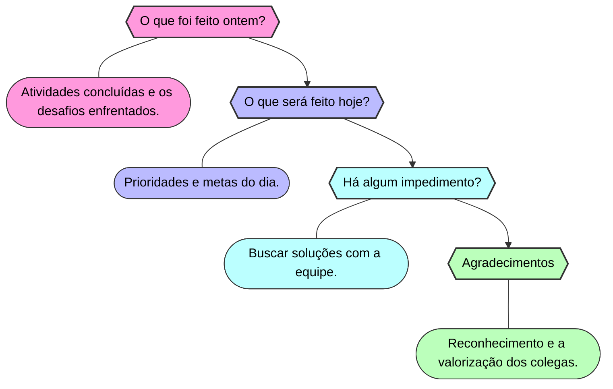

<h1 style="text-align: center">Daily</h1>

##  ☀️	O que é ? 

A daily é uma reunião diária que tem como objetivo principal manter a equipe alinhada e informada sobre o que está sendo feito, o que será feito, se há algum impedimento para a realização das atividades e agradecimento a alguém que tenha fornecido ajuda ou suporte durante as atividades.

  
Mais informações

- È uma prática comum em equipes ágeis e é uma oportunidade para que todos os membros da equipe possam se comunicar e compartilhar informações sobre o andamento do projeto.
- Para saber mais sobre metodologias ágeis, acesse o [Manifesto Ágil](https://agilemanifesto.org/).

---

### 📆 Segunda a sexta-feira das 10:00 às 10:30.

  
Importante

- Fique atento ao horário da daily, pois ela é uma reunião rápida e pontual.
- **Caso não possa participar, avise a equipe com antecedência e envie sua daily por escrito no canal development.**

---

### 📋 Como se preparar para a daily?

- Antes da reunião, é importante que cada membro da equipe reflita sobre o que foi feito no dia anterior, o que será feito no dia atual e se há algum impedimento para a realização das atividades.
- Durante a daily, cada membro deve manter uma postura aberta e receptiva, ouvindo atentamente os colegas e buscando soluções para os desafios identificados.

---

### ✨ Tópicos abordados

  
1 - O que foi feito ontem?

- Cada membro da equipe compartilha brevemente o que foi feito no dia anterior, destacando as atividades concluídas e os desafios enfrentados.

  
2 - O que será feito hoje?

- Após a revisão do dia anterior, cada membro compartilha as atividades que serão realizadas no dia atual, definindo as prioridades e metas a serem alcançadas.

  
3 - Há algum impedimento?

- Caso haja algum impedimento para a realização das atividades, o membro deve compartilhar com a equipe para que juntos possam buscar soluções e superar os desafios.

  
4 - Agradecimentos

- Ao final da daily, é importante agradecer a alguém que tenha fornecido ajuda ou suporte durante as atividades, promovendo o reconhecimento e a valorização dos colegas.

---

  
📊 Resultados Esperados

- **Alinhamento da equipe e compartilhamento de informações sobre o andamento do projeto.**
- **Identificação de impedimentos e desafios que possam afetar o andamento das atividades.**
- **Definição de metas e prioridades para o dia atual, garantindo o sucesso do projeto.**
- **Reconhecimento e valorização dos colegas que forneceram ajuda ou suporte durante as atividades.**

---
