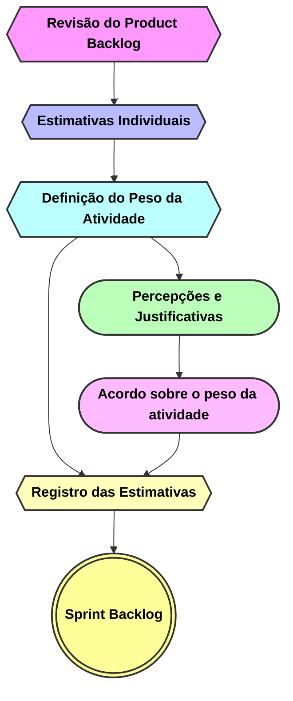

<h1 style="text-align: center">Poker Planning</h1>

## 🃏 O que é ?

O Poker Planning é uma técnica utilizada para estimar o esforço necessário para a realização de uma tarefa. A equipe se reúne para discutir e definir o tamanho relativo das atividades, atribuindo pontos de complexidade a cada uma delas. O objetivo é promover a colaboração entre os membros, compartilhar conhecimento e alinhar as expectativas em relação ao trabalho a ser realizado.

  
Mais informações

- O Poker Planning é uma prática comum em equipes ágeis e representa uma oportunidade para que todos os membros possam contribuir com suas percepções e experiências na definição das estimativas.
- Para saber mais sobre estimativas ágeis, acesse o [Guia de Estimativas Ágeis](https://www.atlassian.com/agile/project-management/estimation).

---

### 📆	Ocorre sempre que o Sprint Backlog está ficando vazio.

#### local de realização:
[Planning Poker Online ](https://planningpokeronline.com/)

  
Importante

- **O horário é pré-definido entre a equipe, estabelecendo uma regularidade de encontros sempre que o sprint backlog estiver ficando vazio.**
- A duração da reunião pode variar de acordo com a quantidade de atividades a serem estimadas.
- **A participação de todos os membros da equipe é fundamental para o sucesso do Poker Planning, portanto se não puder participar, avise com antecedência.**

---

### 📋 Como se preparar para o Poker Planning?

- Antes da reunião, é importante que cada membro da equipe revise as atividades que serão pesadas, identificando possíveis dependências e complexidades.
- Durante o Poker Planning, todos os membros devem manter uma postura aberta e receptiva, ouvindo atentamente uns aos outros e buscando consenso nas estimativas.

---

### ✨	Etapas do Poker Planning

  
1 - Revisão do Product Backlog:

- Iniciamos o Poker Planning com uma revisão do Product Backlog, discutindo as histórias de usuário e as tarefas que serão estimadas.
- **O Product Owner é responsável por esclarecer dúvidas e fornecer informações adicionais sobre as atividades.**

  
2 - Estimativas individuais:

- Cada membro da equipe atribui pontos de complexidade às atividades, de acordo com sua percepção e experiência.
- **As estimativas são feitas individualmente, sem influência dos demais membros.**
- Os pontos são atribuídos de acordo com a escala de Fibonacci, que varia de 2 a 8.

  
3 - Definição do peso da atividade:

- Após as estimativas individuais, os membros da equipe compartilham suas percepções e justificativas para as estimativas atribuídas.
- **O objetivo é chegar a um consenso sobre o peso da atividade, considerando as diferentes perspectivas e experiências.**
- Caso haja divergências, a equipe discute os pontos de vista e busca um acordo sobre a complexidade da atividade.
- **O Scrum Master é responsável por mediar as discussões e garantir que a equipe chegue a um consenso.**
- Ao final, a atividade é atribuída com um único valor de complexidade, que representa o esforço necessário para sua realização.

  
4 - Registro das estimativas:

- As estimativas são registradas nas issues presentes no product backlog.
- Após a definição dos pesos, as issues são movidas para o sprint backlog, indicando que estão prontas para serem realizadas.
- **O Product Owner é responsável por manter o backlog atualizado e garantir que as estimativas sejam consideradas no planejamento do sprint.**

---

  
📌 Definição dos pesos (Height)

<table>
    <thead>
        <tr><th>Peso</th><th>Descrição</th></tr>
    </thead>    
    <tbody>
        <tr>
            <td>1</td><td>Tarefa muito simples</td>
        </tr>
        <tr>
            <td>2</td><td>Tarefa simples e rápida de ser realizada.</td>
        </tr>
        <tr>
            <td>3</td><td>Tarefa que requer um pouco mais de esforço, mas ainda é relativamente simples.</td>
        </tr>
        <tr>
            <td>5</td><td>Tarefa complexa que requer um esforço e pode envolver algumas complexidades.</td>
        </tr>
        <tr>
            <td>8</td><td>Tarefa muito complexa que requer um esforço significativo e pode envolver muitas complexidades, podendo ser divida em 2 ou mais issues.</td>
        </tr>
    </tbody>
</table>

---

  
📊 Resultados Esperados

- **Compartilhamento de conhecimento e experiências na definição das estimativas.**
- **Alinhamento das expectativas em relação ao esforço necessário para a realização das atividades.**
- **Registro das estimativas no product backlog, facilitando o planejamento do sprint.**
- **Promoção da colaboração e do trabalho em equipe.**
- **Identificação de dependências e complexidades nas atividades, permitindo uma melhor distribuição das tarefas.**
- **Melhoria contínua no processo de estimativas e planejamento das atividades.**

---
