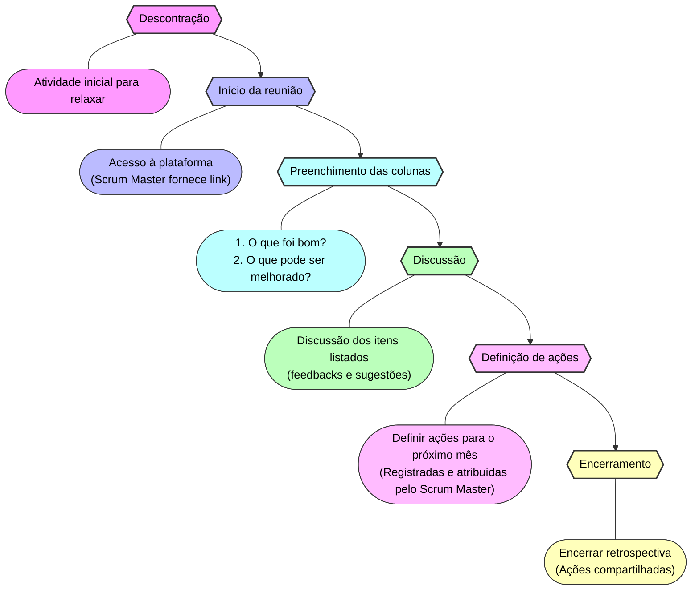

<h1 style="text-align: center">Retrospectiva</h1>

## 🔄 O que é ?

A retrospectiva é uma cerimônia que ocorre ao final de cada mês, onde a equipe se reúne para refletir sobre o que foi positivo, o que pode ser melhorado e as ações que devem ser tomadas no próximo mês. O objetivo é identificar oportunidades de melhoria, compartilhar feedbacks e promover a evolução contínua do time.

  
Mais informações

- A retrospectiva é uma prática comum em equipes ágeis e representa uma oportunidade para que todos os membros possam contribuir com ideias e sugestões para o aprimoramento do processo de desenvolvimento.
- Para saber mais sobre retrospectivas, acesse o [Guia da Retrospectiva](https://www.atlassian.com/agile/scrum/retrospectives).

---

### 📆	Última quinta-feira do mês, das 15:00 às 16:00.

#### local de realização:
[EasyRetro](https://easyretro.io/)

  
Importante

- A duração da retrospectiva pode variar de acordo com a quantidade de itens a serem discutidos.
- **A participação de todos os membros da equipe é fundamental para o sucesso da retrospectiva, portanto se não puder participar, informe com antecedencia a equipe.**

---

### 📋 Como se preparar para a retrospectiva?

- Antes da reunião, é importante que cada membro da equipe reflita sobre o que foi positivo e o que pode ser melhorado no último mês.
- Durante a retrospectiva, todos os membros devem manter uma postura aberta e receptiva, ouvindo atentamente uns aos outros e buscando soluções para os desafios identificados.

---

### ✨	Etapas da Retrospectiva

  
1 - Descontração:

- Iniciamos a retrospectiva com uma atividade descontraída para que todos possam relaxar e se sentir à vontade.
- A atividade pode variar entre jogos, dinâmicas ou conversas entre a equipe sobre qualquer coisa que não seja o trabalho.

  
2 - Inicio da reunião:

- Após a atividade de descontração, acessamos a plataforma onde a retrospectiva será realizada.
- **O Scrum Master disponibiliza o link da plataforma no canal de comunicação da equipe.**

  
3 - preenchimento das colunas:

- Na plataforma, haverá um quadro com três colunas:
<table>
    <tr>
        <th>O que foi bom?</th>
        <th>O que pode ser melhorado?</th>
        <th>Ações para o próximo mês.</th>
    </tr>
    <tr>
        <td> ... </td>
        <td> ... </td>
        <td> ... </td>
    </tr>
    <tr>
        <td> ... </td>
        <td> ... </td>
        <td> ... </td>
    </tr>
</table>

- **Cada membro da equipe preenche as colunas com suas ideias e sugestões.**

  
4 - Discussão:

- Após o preenchimento das duas primeiras colunas, a equipe discute os itens listados, compartilhando feedbacks e sugestões para a melhoria contínua.

  
5 - Definição de ações:

- Ao final da discussão, a equipe define as ações que devem ser tomadas no próximo mês para melhorar o processo de desenvolvimento.
- **As ações são registradas pelo Scrum Master na terceira coluna do quadro e atribuídas a um responsável.**

  
6 - Encerramento:

- **A retrospectiva é encerrada e as ações definidas são compartilhadas no canal de comunicação da equipe.**

---

  
📊 Resultados Esperados

- **Identificação de oportunidades de melhoria e ações para o próximo mês.**
- **Compartilhamento de feedbacks e sugestões para a evolução contínua do time.**
- **Promoção de um ambiente de trabalho saudável e produtivo.**
- **Engajamento e comprometimento de todos os membros da equipe com o processo de desenvolvimento.**

---
