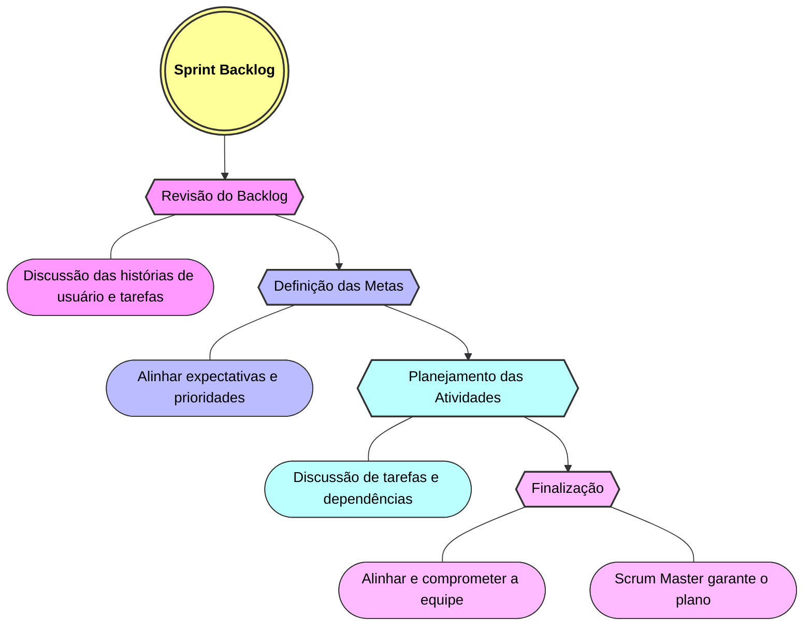

<h1 style="text-align: center">Sprint Planning</h1>

## 🚀 O que é ?

O Sprint Planning é uma cerimônia que ocorre no início de cada sprint, onde a equipe se reúne para planejar e definir as atividades que serão realizadas durante o ciclo. O objetivo é alinhar as expectativas, definir as metas e prioridades da sprint.

  
Mais informações

- Nesta reunião participam os responsáveis pelo projeto, o Product Owner, o Scrum Master e o Product Manager.
- O Sprint Planning é uma prática comum em equipes ágeis e representa uma oportunidade para que os gestores façam o planejamento do projeto.

---

### 📆	Ocorre no início de cada sprint, às segundas-feiras das 09:00 às 09:30.

  
Importante

- **O Product Owner, o Scrum Master e o Product Manager são responsáveis por conduzir a reunião, portanto é importante que estejam presentes e preparados para liderar as discussões.**
- **A duração do Sprint Planning pode variar de acordo com a complexidade do projeto e a quantidade de itens a serem discutidos.**

---

### 📋 Como se preparar para o Sprint Planning?

- Antes da reunião, é importante que os gestores analizem o board e listem pontos importantes sobre o andamento do projeto
- Durante o Sprint Planning, todos os membros devem manter uma postura aberta e receptiva, ouvindo atentamente uns aos outros e buscando soluções para os desafios identificados.

---

### ✨	Etapas do Sprint Planning

  
1 - Revisão do Backlog:

- Iniciamos o Sprint Planning com uma revisão do backlog do produto, discutindo as histórias de usuário e as tarefas que serão realizadas durante a sprint.

  
2 - Definição das Metas:

- Após a revisão do backlog, definimos as metas e prioridades da sprint, alinhando as expectativas.

  
3 - Planejamento das Atividades:

- Durante o planejamento, discutimos as tarefas que serão realizadas e definimos as dependências entre as atividades.

  
4 - Finalização:

- Ao final do Sprint Planning, todos os membros da equipe devem estar alinhados e comprometidos com as metas e atividades definidas, garantindo o sucesso da sprint.
- **O Scrum Master é responsável por garantir que o time siga o plano estabelecido, removendo impedimentos e mantendo a equipe focada.**

---

  
📊 Resultados Esperados

- **Definição das metas e prioridades da sprint.**
- **Alinhamento das expectativas e comprometimento com o sucesso do projeto.**
- **Identificação de dependências e impedimentos que possam afetar o andamento da sprint.**

---
